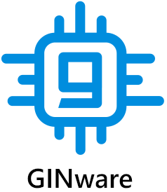

<p align="center">
<br>
<span style="font-size:20px;">A <a href="https://gincoin.io"><b>GIN</b>coin</a> hard<b>ware</b> wallet tool</span><br><br>
<a href="https://github.com/GIN-coin/ginware/releases/latest"></a>
<br>
<a href="https://travis-ci.com/GIN-coin/ginware"></a>
<a href="https://github.com/GIN-coin/ginware/releases/latest"></a>
<a href="https://keybase.io/zakurai"></a>
<a href="https://keybase.io/zakurai"></a>
</p>

#

GINware can perform a variety of tasks with hardware wallets - such as **storing and transferring GINcoins**, and **starting GINcoin masternodes**.

For a detailed usage guide, please see [here](https://docs.gincoin.io/guides/ginware-guide-hw-wallets).

#

* [Supported hardware wallets](#supported-hardware-wallets)
* [Downloads](#downloads)
* [Motivation (for masternode operators)](#motivation-for-masternode-operators)
* [Verifying releases](#verifying-releases)
* [Connection setup](#connection-setup)
* [Commandline parameters](#commandline-parameters)
* [Build instructions](#build-instructions)

## Supported hardware wallets
- [x] Ledger Nano S
- [x] Trezor One
- [x] Trezor Model T

## Downloads
Latest releases: https://github.com/GIN-coin/ginware/releases/latest

## Motivation (for masternode operators)
As part of the process of running a GINcoin masternode, you (the masternode operator) must dedicate 1000 GIN as collateral, which is linked to your node, and must stay linked to keep your masternode running. The key controlling the funds should be kept separately from the masternode server.

Before the GINcoin network accepts a new masternode, the operator controlling the node must prove that they are also in control of the key to the 1000 GIN collateral. This is achieved by sending a special message to the network (the `masternode start` message), signed with this key. This action is traditionally carried out using the GINcoin Core software, **but can also now be performed with GINware**.

As hardware wallets keep your keys isolated from your computer (and therefore, the internet), managing masternodes with GINware is far safer and **highly recommended** for all masternode operators.

*Note that while the 1000 GIN transaction is called "collateral", the coins belong to you and won't be forfeited - the term instead refers to how you cannot use those coins as long as your masternode is running. As soon as you move the coins, the masternode will be kicked from the network.*

## Verifying releases
Releases are compiled with Travis CI, so you can compare the SHA256 hash of the release with the hash shown in the Travis build log. Each release should also have an `.asc` file that you can use to verify that the release was signed by the current maintainer **@zakurai**.

The verification method described below is based on use of the Keybase application, so if you have not already done so, please download the installer from https://keybase.io/download, install the app, and follow the steps below.

1. Open your OS command line terminal.

2. Change the current directory to the folder where the GINware release files were downloaded (example below):
   `cd /Users/<username>/ginware-dist`
   After invoking the *list directory* command (`dir /B` for Windows, `ls` for Mac/Linux) you should see both the archived executable (.tar.gz / .zip) and the corresponding signature file (.asc):
   ```
   <username>: ls
   GINware_1.0.0.win32.zip    GINware_1.0.0.win32.zip.asc
   ```
3. Verify the signature by executing the following command:
   ```
   keybase pgp verify -d SIGNATURE -i BINARY -S zakurai
   ```
   for example:
   ```
   keybase pgp verify -d GINware_1.0.0.win32.zip.asc -i GINware_1.0.0.win32.zip -S zakurai
   ```
   You should see something similar to the following if verification was successful (check for `Signature verified`):
   ```
   ▶ INFO Identifying zakurai
   OK public key fingerprint: C3A0 AEA9 3E86 F6CE 46CA 5808 E404 25A3 568C D89D
   XLM  Stellar GAJULTOOXBKEICMGOHMJQUBU2HN52DGLV2722GLVVNU37ZAKHDW4PVSA (zakurai*keybase.io)
   OK "zakurai" on github: https://gist.github.com/ca35cec6a95692a0308ffe01a4921fd9 [cached 2019-04-29 09:13:04 AEST]
   Signature verified. Signed by zakurai 2 hours ago (2019-04-29 06:48:55 +1000 AEST).
   PGP Fingerprint: c3a0aea93e86f6ce46ca5808e40425a3568cd89d.
   ```

## Connection setup
Most features involve exchanging data between GINware itself and the GINcoin network. To do this, GINware needs to connect to a GINcoin full node that can handle JSON-RPC requests. It is good to choose a node that you can trust - the best choice being a decentralised full node that you run yourself. The core software for a full node can be found [here](https://github.com/GIN-coin/gincoin-core/releases/latest).

## Commandline parameters
GINware currently supports the following commandline parameters:
* `--data-dir`: a custom path to a folder to use for user data. This data includes the config file, cache files and log files
  * Useful for users who want to avoid leaving any files on their computer (i.e. want to use an external drive)
  * e.g. `GINware.exe --data-dir=D:\ginware`
* `--config`: a custom path to a config file.
  * Useful if you don't mind keeping cache/log files in the default location, but want to keep the config file elsewhere.
  * e.g. `GINware.exe --config=C:\ginware-configs\config1.ini`

## Build instructions
GINware is written in Python 3, so you can clone the source code, install dependencies, and run straight through a Python 3.6+ interpreter.

Otherwise, you can compile binaries using Pyinstaller, which include the intepreter, source files and dependencies in a convenient package. This is the same format used in the official releases [here](https://github.com/GIN-coin/ginware/releases/latest).

Build instructions for each OS:
   * [Windows](doc/build-ginware-windows.md)
   * [macOS](doc/build-ginware-mac.md)
   * Linux
      * [Ubuntu](doc/build-ginware-linux-ubuntu.md)
      * [Fedora](doc/build-ginware-linux-fedora.md)