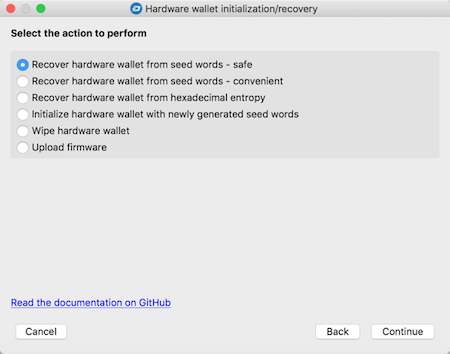
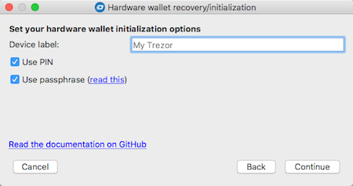
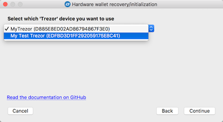
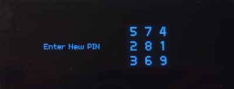
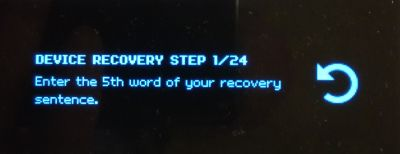
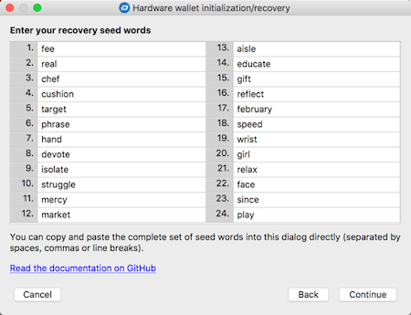
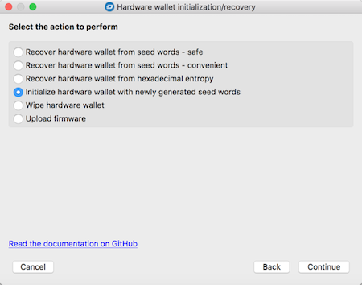
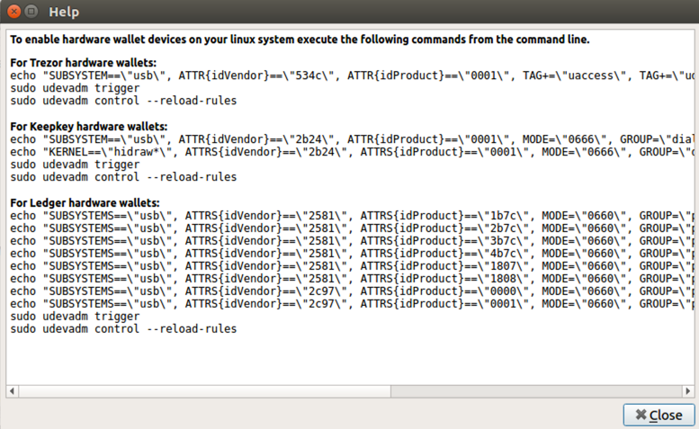
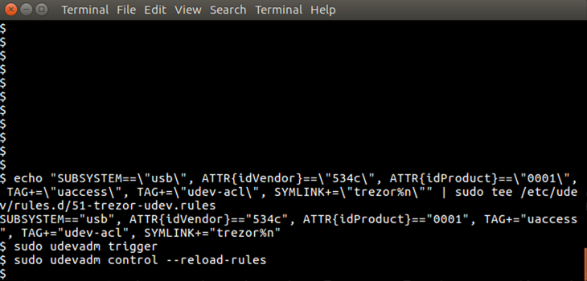

## Hardware wallet initialization and recovery

 * [Introduction](#Introduction)  
 * [Understanding the *recovery seed*](#understanding-the-recovery-seed)  
 * [Security principles](#security-principles)  
 * [Hardware wallet initialization and recovery in DMT](#hardware-wallet-initialization-and-recovery-in-dmt)  
    * [Hardware wallet recovery - safe mode](#hardware-wallet-recovery-safe-mode)  
    * [Hardware wallet recovery - convenient mode](#hardware-wallet-recovery-convenient-mode)  
    * [Hardware wallet recovery from hexadecimal entropy](#hardware-wallet-recovery-from-hexadecimal-entropy)  
    * [Hardware wallet initialization with a newly generated seed words](#hardware-wallet-initialization-with-a-newly-generated-seed-words)  
    * [Wiping hardware wallet](#wiping hardware wallet)
 * [Running DMT on an offline Linux system](#running-dmt-on-an-offline-linux-sysytem)

### Introduction

Hardware wallets must be properly prepared for operation before their first use. This can be achieved with one of the following two scenarios:

- Initialization - a process that consists of generating a new set of private keys and related addresses on the device.

- Recovery - a process that consists of restoring a set of keys (and addresses) used previously, e.g. in another hardware or software wallet. This method is usually used when the previous device has failed, or we are simply "migrating our funds" to another device.


Although both scenarios are supported by official applications provided by manufacturers of the devices, there is a reason why those functionalities have been implemented within the DashMasternodeTool. Namely, Trezor - undoubtedly the most popular hardware wallet - despite its numerous advantages has one drawback: the official client application is a web-based solution, so in order to work it requires an Internet connection. It is therefore impossible to use it on an offline computer – and that is highly recommended considering the omnipresent malware and significant value of funds controlled by this type of devices. It should also be taken into account that if the website [http://wallet.trezor.com](http://wallet.trezor.com/) is ever unavailable for whatever reason, it will be impossible to perform initialization or recovery, at least at that moment.

### Understanding the *recovery seed*

All three hardware wallets compatible with DMT (Trezor, Keepkey and Ledger Nano S) support the BIP-32/BIP-44/BIP-39 standards. Without getting too much into their details, it’s enough to know that as a result:

- the device stores an entire tree of private keys and corresponding payment addresses,
- all those keys are generated based on so-called *entropy* – which is essentially a unique number with the length of 16 up to 32 bytes,
- for a person to be able to memorize the *entropy*, it is converted into a set of 12 up to 24 words, later referred to as *recovery seed*. 

Initialization of the device is actually the activity of generating new *entropy* and presenting it to a user as a set of words, while recovery is a reversed activity – passing a set of words forming the *recovery seed* to the device, and then converting them to *entropy* inside the device. This *entropy* is the basis for generating an entire set of keys, which was splendidly described by Andreas Antonopolous in his magnificent book “Mastering Bitcoin” (see: [https://github.com/bitcoinbook/bitcoinbook/blob/second_edition/ch05.asciidoc#wallet-technology-details](https://github.com/bitcoinbook/bitcoinbook/blob/second_edition/ch05.asciidoc))

### Security principles

It’s good to be aware that knowing the set of words composing a *recovery seed* means having access to funds controlled by those keys. So, if they get in the wrong hands, we risk losing our funds. Analogically, if we lose the *recovery seed*, we will also lose access to our funds and there are no technical ways of retrieving them.

Standard methods of initialization and recovery of devices are designed in such a way that they should be safe even on an infected computer. But with significant funds controlled by such *recovery seed*, you don’t have to be paranoid to think that it’s better to perform such activities offline. This especially concerns users working on Windows computers or on computers, to which numerous files are downloaded from the Internet, exposing them to potential infections.

To such people (but not only them), I strongly recommend performing recovery or initialization in Linux OS launched from a [live CD](#running-dmt-on-an-offline-linux-system) – after its work is done, there will be no data saved that could be sent to hostile server on the first occasion.

### Hardware wallet initialization and recovery in DMT

All functionalities described in this chapter are available in the *Hardware wallet initialization/recovery* dialog window, launched from the Tools menu of DMT application. They work like a standard wizard-type dialog, where interaction with the user is divided into separate steps.  

List of available functions:

- [Hardware wallet recovery - safe mode](#hardware-wallet-recovery-in-safe-mode)
- [Hardware wallet recovery - convenient mode](#hardware-wallet-recovery-convenient-mode)
- [Hardware wallet recovery from hexadecimal entropy](#hardware-wallet-recovery-from-hexadecimal-entropy)
- [Hardware wallet initialization with a newly generated seed words](#hardware-wallet-initialization-with-a-newly-generated-seed-words)
- [Wiping hardware wallet](#wiping-hardware-wallet)

> For Ledger Nano S wallets, only two of the above options are available (second and third) – other options are not supported by the official Ledger API, so it was not possible to create a GUI for them within DMT. This, however, is not a big problem, as these functions are available through the interface of the device itself. 

#### Hardware wallet recovery - safe mode

For Trezor and Keepkey wallets, this is a standard recovery scenario. Its characteristic trait is that the user enters individual words composing the *recovery seed* in a random order, while the number of the word to be entered is shown only on the screen of the device. So one could say that it’s safe even on computers where malware is listening to everything we type on a keyboard. In this case it would be able to capture individual words, but not their order in the complete set, making it useless.

**Steps of the procedure**

1. On the first page of the wizard, select the right hardware wallet type.  
  

2. Select the option *Recover hardware wallet from seed words – safe*.  
  

3. Select the number of words in your recovery seed.   
  

4. Define hardware wallet configuration options.  
  Enter the device label and decide whether or not you wish to use a PIN and/or a passphrase.  
  

5. (Optional) Select the device instance.  
  This step will only be shown when there are more devices of the same type connected to the computer.  
  

6. (Optional) Confirm wiping the device.  
  If the device is already initialized (it contains previously generated keys), it will ask you if you are certain it should be “wiped”. In order to confirm, you need to use appropriate buttons on the device.  
  
   

7. Enter new PIN according to the matrix displayed on the device screen.  
  The device will ask you to provide your PIN twice to verify that it’s correct.  
  
   

8. Enter words composing the recovery seed.  
  The number of the word the user should enter will be presented on the screen of the hardware wallet - as mentioned before, for security reasons the order will be random.  
  
    
  At the same time DMT will ask you to enter the word:  
    
  You will see requests for individual words as many times as the number of words in your recovery seed. The last word acts as a checksum – a mechanism that verifies whether both the words and their order are correct. In case of an error, the below alert will appear:  
    
  In such case, you need to start the procedure again.  
  Successful completion of the process will be announced with a message as shown below:  
  


#### Hardware wallet recovery - convenient mode

This procedure differs from the previous one in that the words composing recovery seed are entered in a special editor, all visible at the same time. This method is more convenient than entering each word separately, but it also has its security-related requirements.

> **Remark concerning Ledger Nano S wallet**  
> Before launching this function, you should put the device in Recovery mode, as described on the first screen of the wizard.


> **Remarks on security**  
> During one of the steps in this scenario, all words of the recovery seed will be at some point visible on the computer screen. That makes it critical to perform this scenario only on an offline computer, unless we are doing it for testing purposes. By “offline” we mean a system that is not and never will be connected to a network.  
> For the purposes of this scenario, it’s best to use a system launched from a live CD (as described [here](#running-dmt-on-an-offline-linux-system)), that ceases to exist as a system after it’s turned off – there will be no trace of it in form of confidential information saved somewhere.

**Steps of the procedure**

1. On the first page of the wizard, select the right hardware wallet type.

2. In the step *Select the action to perform,* select *Recover hardware wallet from seed words – convenient*.  
   

3. Select the number of words in your recovery seed.   
   

4. After moving on to the next page, enter all words composing the recovery seed in corresponding fields.  
   

5. On the next page, define additional configuration options of the hardware wallet.  
   Note: for Ledger Nano S devices, this window is slightly more complex than in case of Trezor and Keepkey.  
   **Options for Trezor and Keepkey devices**  
     

   - Use PIN: if checked, a PIN entered by the user in the field to the right of this option will be set on the device
   - Use passphrase: if checked, the passphrase option will be switched on

   **Options for Ledger Nano S devices**  
     
   -  Use PIN: like above
   -  Use passphrase: check this option if you are using a passphrase (BIP-39) and you want to save it in the device memory. It might not seem like the best idea, but in case of this device, the alternative is to enter the passphrase whenever it’s needed with the use of two physical buttons, which is annoying even for short character strings, and becomes a nightmare in case of long ones. This option was prepared quite reasonably, providing as much security as possible in such situations. Passphrase is only activated when at the point of connecting the device the user enters the Secondary PIN – otherwise, the basic set of keys is activated.

   **Preview addresses**  
   In this step of the wizard, there is a possibility to preview what Dash addresses will be available in the device after it’s initialized, based on the entered recovery seed. This option can be useful for verification purposes or to people who had previously initialized their device but now have doubts whether the recovery seed saved then was correct. It can be easily checked here, by verifying if the addresses shown in the preview match those presented by the device for a given BIP-32 path.
   In order to launch the preview, click the button Show preview.  
     
   Here we have the possibility to change the BIP-32 path to different than the standard one and verify the influence of passphrase to the generated address. 

6. In the next step, accept the security related question.  
   In this step, Trezor and Keepkey devices display (quite reasonably) a warning, informing that it might not be safe to import the whole recovery seed from the computer to the device. As mentioned before, if at any point a complete recovery seed is found on a working OS, and the computer is (or will be) connected to the Internet, there is a risk that data could be taken over by unauthorized people, which could result in potential financial loss.  
   
     
   If the operation is performed on an offline system, we can safely click the button to confirm our awareness of this fact. This is followed by the following message, finishing the whole procedure:  
   

#### Hardware wallet recovery based on entropy
Note: for security reasons this procedure should only be performed on offline systems.


This option can be useful for people storing recovery seed in form of entropy (a number between 12 and 32 bytes) or people who don’t trust random number generators used by hardware wallets to generate a new set of words, and instead prefer to use the most reliable source of randomization like, for instance, a multiple coin toss. In such situations, for an entropy corresponding to 24 words of the recovery seed, we perform 256 coin tosses and we treat each result as a binary “0” or “1”. We then convert the binary string to HEX, which is then entered according to the description below.

**Steps of the procedure**

1. On the first page of the wizard, select the right hardware wallet type.

2. On the second page, choose the option *Recover hardware wallet from hexadecimal entropy*.

3. On the next page, enter the entropy as a hexadecimal string – 16, 24 or 32 bytes long. The length of entropy will influence the number of words of the recovery seed to be reproduced.  
   

4. In the next step a static list of words will be displayed, corresponding to the entered entropy, which allows you to create a „paper” backup if you need it.  
   

5. Define addtional hardware wallet options as decribed in step 5 of the previous scenario.

6. Accept the security related question as described in step 5 of the previous scenario.

#### Hardware wallet initialization with a newly generated seed words
This functionality is only available for Trezor and Keepkey wallets – Ledger Nano S devices have it implemented in their firmware, but the process is completely controlled by its physical buttons.

This option is used when we want to generate a brand-new set of private keys. Two random number generators take part in this process: one in the hardware wallet, and the other in the computer it’s connected to. The generated entropy (and words resulting from it) is a combination of both. The purpose of such approach is to ensure maximum randomization.

**Steps of the procedure**
1. On the first page of the wizard, select the right hardware wallet type.

2. In the second step, select the option *Initialize hardware wallet with newly generated seed words*.  
   

3. In the next step, select the number of words to be generated as recovery seed.  
  The more words, the lower the risk of creating the same set for two different people. Even for 12 words there is hardly any risk, but I would still suggest that you choose the highest value, which is 24.  
   

4. After getting to the next step, the device will generate new entropy and display it on its screen. It needs to be confirmed by pressing an appropriate button on the device.  
   
   

5. The device will begin to display subsequent words composing the recovery seed. These words should be written down and kept safe. The Keepkey wallet, which has a bigger screen, displays more words at once. After presenting all words from the complete set, the device will show them all again – this is the last step that allows you to verify if all words were noted correctly.  
   
     
   When this step is done, the device is initialized.

#### Wiping hardware wallet
This is a very simple, 2-step procedure, that we perform if for some reason we want to clear the memory of a hardware wallet.

**Steps of the procedure**

1. On the first page of the wizard, select the right hardware wallet type.

2. On the second page, choose the option *Wipe hardware wallet*.

3. In the DMT's message dialog confirm that you really want to wipe the device.

4. Confirm the second time, using hardware wallet's physical button.


### Running DMT on an offline Linux system
Some of the scenarios presented above, for their security require running DMT on an offline computer. For this purpose, the distribution of Ubuntu Linux is perfectly suitable, because it can be run from a DVD or USB media (without installing it) and after performing the hardware wallet recovery / initialization it won't leave any sensitive information on the computer.

1. Create a Linux bootable DVD/USB: https://help.ubuntu.com/community/LiveCD
2. Boot up your computer from the LiveCD or LiveUSB media. I suggest using a computer without any hard drives (or at least physically disconnectiong them) and with cable-type network connection.
  When booting, choose the "Try Ubuntu" option:  
  
3. On the running Linux system, download the latest DashMasternodeTool archived binary (.tar.gz) from the project page or copy the file to the system another way. 
4. Uncompress the file by double-clicking it. 
5. Disconnect the computer from the network (unplug the cable) and remove all additional USB media.
6. Launch DMT.
7. Execute the *Hardware wallet initialization / recovery* dialog from the Tools menu.
8. Add the appropriate udev rules to make your hardware wallet visible on the system.  
  For this, click the "see the details" link as on the screenshot below:  
    
  The following help window will show up:  
    
  Copy the commands appropriate for your hardware wallet type and execute them one-by one in a terminal window:  
  
9. Perform the desired hardware wallet procedure (initialization or recovery).
10. Shut down the system.

**Copy of the commands creating the udev rules, required by hardware wallets supported by DMT**

**For Trezor hardware wallets**
```
echo "SUBSYSTEM==\"usb\", ATTR{idVendor}==\"534c\", ATTR{idProduct}==\"0001\", TAG+=\"uaccess\", TAG+=\"udev-acl\", SYMLINK+=\"trezor%n\"" | sudo tee /etc/udev/rules.d/51-trezor-udev.rules
sudo udevadm trigger
sudo udevadm control --reload-rules
```

**For Keepkey hardware wallets**
```
echo "SUBSYSTEM==\"usb\", ATTR{idVendor}==\"2b24\", ATTR{idProduct}==\"0001\", MODE=\"0666\", GROUP=\"dialout\", SYMLINK+=\"keepkey%n\"" | sudo tee /etc/udev/rules.d/51-usb-keepkey.rules
echo "KERNEL==\"hidraw*\", ATTRS{idVendor}==\"2b24\", ATTRS{idProduct}==\"0001\", MODE=\"0666\", GROUP=\"dialout\"" | sudo tee -a /etc/udev/rules.d/51-usb-keepkey.rules
sudo udevadm trigger
sudo udevadm control --reload-rules
```

**For Ledger hardware wallets**
```
echo "SUBSYSTEMS==\"usb\", ATTRS{idVendor}==\"2581\", ATTRS{idProduct}==\"1b7c\", MODE=\"0660\", GROUP=\"plugdev\"" | sudo tee /etc/udev/rules.d/20-hw1.rules
echo "SUBSYSTEMS==\"usb\", ATTRS{idVendor}==\"2581\", ATTRS{idProduct}==\"2b7c\", MODE=\"0660\", GROUP=\"plugdev\"" | sudo tee -a /etc/udev/rules.d/20-hw1.rules
echo "SUBSYSTEMS==\"usb\", ATTRS{idVendor}==\"2581\", ATTRS{idProduct}==\"3b7c\", MODE=\"0660\", GROUP=\"plugdev\"" | sudo tee -a /etc/udev/rules.d/20-hw1.rules
echo "SUBSYSTEMS==\"usb\", ATTRS{idVendor}==\"2581\", ATTRS{idProduct}==\"4b7c\", MODE=\"0660\", GROUP=\"plugdev\"" | sudo tee -a /etc/udev/rules.d/20-hw1.rules
echo "SUBSYSTEMS==\"usb\", ATTRS{idVendor}==\"2581\", ATTRS{idProduct}==\"1807\", MODE=\"0660\", GROUP=\"plugdev\"" | sudo tee -a /etc/udev/rules.d/20-hw1.rules
echo "SUBSYSTEMS==\"usb\", ATTRS{idVendor}==\"2581\", ATTRS{idProduct}==\"1808\", MODE=\"0660\", GROUP=\"plugdev\"" | sudo tee -a /etc/udev/rules.d/20-hw1.rules
echo "SUBSYSTEMS==\"usb\", ATTRS{idVendor}==\"2c97\", ATTRS{idProduct}==\"0000\", MODE=\"0660\", GROUP=\"plugdev\"" | sudo tee -a /etc/udev/rules.d/20-hw1.rules
echo "SUBSYSTEMS==\"usb\", ATTRS{idVendor}==\"2c97\", ATTRS{idProduct}==\"0001\", MODE=\"0660\", GROUP=\"plugdev\"" | sudo tee -a /etc/udev/rules.d/20-hw1.rules
sudo udevadm trigger
sudo udevadm control --reload-rules
```


```

```