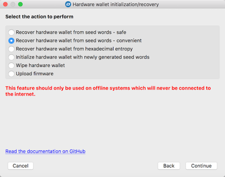
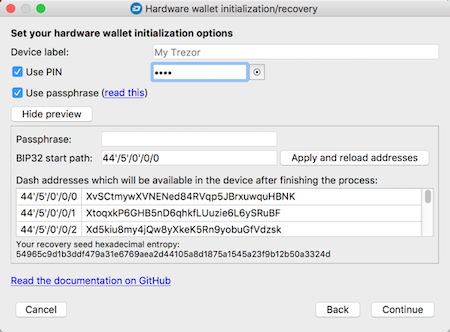
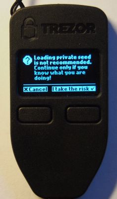
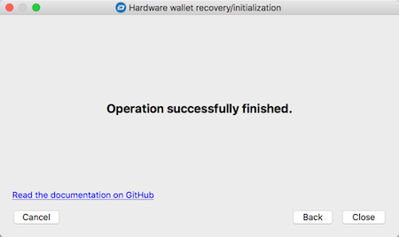

## Hardware wallet recovery - convenient mode

This procedure differs from the previous one in that the words composing recovery seed are entered in a special editor, all visible at the same time. This method is more convenient than entering each word separately, but it also has its security-related requirements.

> **Remark concerning Ledger Nano S wallet**  
> Before launching this function, you should put the device in Recovery mode, as described on the first screen of the wizard.

> **Remarks on security**  
> During one of the steps in this scenario, all words of the recovery seed will be at some point visible on the computer screen. That makes it critical to perform this scenario only on an offline computer, unless we are doing it for testing purposes. By “offline” we mean a system that is not and never will be connected to a network.  
> For the purposes of this scenario, it’s best to use a system launched from a live CD (as described [here](hw-initr-live-cd-linux.md)), that ceases to exist as a system after it’s turned off – there will be no trace of it in form of confidential information saved somewhere.

##### Step 1. On the first page of the wizard, select the right hardware wallet type.

##### Step 2. Select the *Recover hardware wallet from seed words – convenient* option.  

##### Step 3. Select the number of words in your recovery seed.   

##### Step 4. Enter all words composing the recovery seed in corresponding fields.  

##### Step 5. Define additional configuration options of the hardware wallet.  
Note: for Ledger Nano S devices, this window is slightly more complex than in case of Trezor and Keepkey.    

**Options for Trezor and Keepkey devices**  
  
- Use PIN: if checked, a PIN entered by the user in the field to the right of this option will be set on the device
- Use passphrase: if checked, the passphrase option will be switched on

**Options for Ledger Nano S devices**  
  
-  Use PIN: like above
-  Use passphrase: check this option if you are using a passphrase (BIP-39) and you want to save it in the device memory. It might not seem like the best idea, but in case of this device, the alternative is to enter the passphrase whenever it’s needed with the use of two physical buttons, which is annoying even for short character strings, and becomes a nightmare in case of long ones. This option was prepared quite reasonably, providing as much security as possible in such situations. Passphrase is only activated when at the point of connecting the device the user enters the Secondary PIN – otherwise, the basic set of keys is activated.  

**Preview addresses**  
In this step of the wizard, there is a possibility to preview what Dash addresses will be available in the device after it’s initialized, based on the entered recovery seed. This option can be useful for verification purposes or to people who had previously initialized their device but now have doubts whether the recovery seed saved then was correct. It can be easily checked here, by verifying if the addresses shown in the preview match those presented by the device for a given BIP-32 path.
In order to launch the preview, click the button Show preview.

 
 
Here we have the possibility to change the BIP-32 path to different than the standard one and verify the influence of passphrase to the generated address. 

##### Step 6. Accept the security related question. 
In this step, Trezor and Keepkey devices display (quite reasonably) a warning, informing that it might not be safe to import the whole recovery seed from the computer to the device. As mentioned before, if at any point a complete recovery seed is found on a working OS, and the computer is (or will be) connected to the Internet, there is a risk that data could be taken over by unauthorized people, which could result in potential financial loss.  

  

If the operation is performed on an offline system, we can safely click the button to confirm our awareness of this fact. This is followed by the following message, finishing the whole procedure:  

