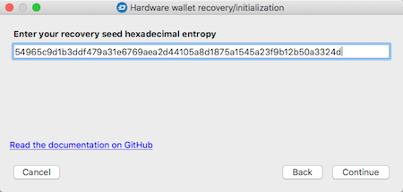
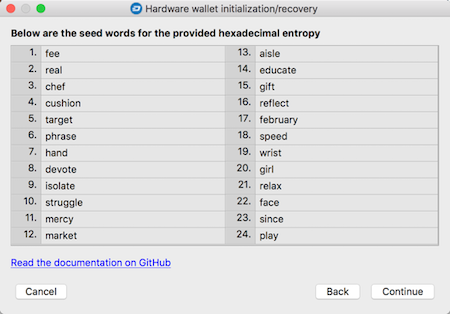

## Hardware wallet recovery based on entropy
Note: for security reasons this procedure should only be performed on offline systems.

This option can be useful for people storing recovery seed in form of entropy (a number between 12 and 32 bytes) or people who don’t trust random number generators used by hardware wallets to generate a new set of words, and instead prefer to use the most reliable source of randomization like, for instance, a multiple coin toss. In such situations, for an entropy corresponding to 24 words of the recovery seed, we perform 256 coin tosses and we treat each result as a binary “0” or “1”. We then convert the binary string to HEX, which is then entered according to the description below.

##### Step 1. On the first page of the wizard, select the right hardware wallet type.

##### Step 2. Choose the option *Recover hardware wallet from hexadecimal entropy*.

##### Step 3. Enter the entropy as a hexadecimal string – 16, 24 or 32 bytes long.
The length of entropy will influence the number of words of the recovery seed to be reproduced.  

##### Step 4. Check the words. 
In the next step a static list of words will be displayed, corresponding to the entered entropy, which allows you to create a „paper” backup if you need it.  

##### Step 5. Define additional hardware wallet options.
This step is described [here.](hw-initr-conv-mode.md#step-5-define-additional-configuration-options-of-the-hardware-wallet)

##### Step 6. Accept the security related question as described in step 5 of the previous scenario.
This step is described [here.](hw-initr-conv-mode.md#step-6-accept-the-security-related-question)

