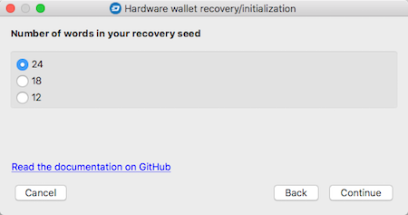

## Hardware wallet initialization with a newly generated seed words
This functionality is only available for Trezor and Keepkey wallets – Ledger Nano S devices have it implemented in their firmware, but the process is completely controlled by its physical buttons.

This option is used when we want to generate a brand-new set of private keys. Two random number generators take part in this process: one in the hardware wallet, and the other in the computer it’s connected to. The generated entropy (and words resulting from it) is a combination of both. The purpose of such approach is to ensure maximum randomization.

##### Step 1. On the first page of the wizard, select the right hardware wallet type.

##### Step 2. Select the option *Initialize hardware wallet with newly generated seed words*.  

##### Step 3. Select the number of words to be generated as recovery seed.  
The more words, the lower the risk of creating the same set for two different people. Even for 12 words there is hardly any risk, but I would still suggest that you choose the highest value, which is 24.  

##### Step 4. Confirm the generated entropy.

##### Step 5. Confirm and write down words.
The device will begin to display subsequent words composing the recovery seed. These words should be written down and kept safe. The Keepkey wallet, which has a bigger screen, displays more words at once. After presenting all words from the complete set, the device will show them all again – this is the last step that allows you to verify if all words were noted correctly.  

  

When this step is done, the device is initialized.